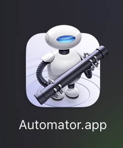
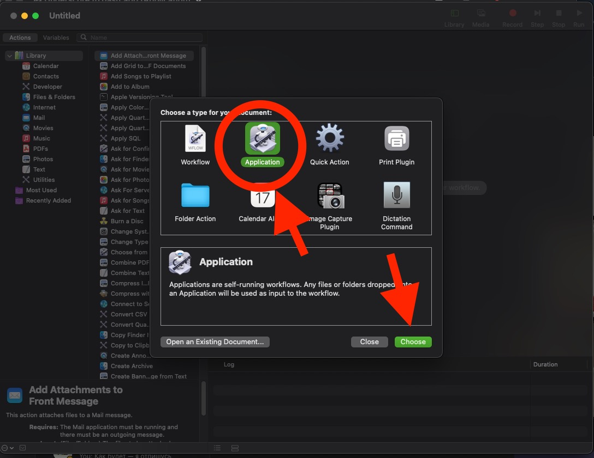
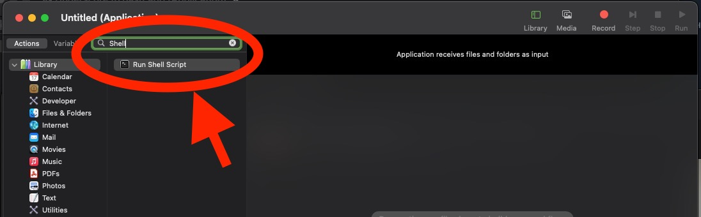
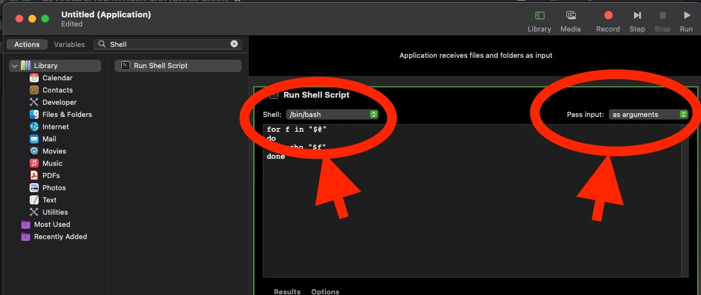

# 🖱 macOS Automator Droplet — Replace `_` with `-` in filenames

This Automator **Application** (Droplet) allows you to drag and drop one or more files from Finder, and it will automatically rename them by replacing all underscores `_` with dashes `-`.

---

## ⚙ How it works

- Built in **Automator** as an **Application** (Droplet).
- Uses a **Shell Script** inside Automator to process dropped files.
- Creates a log file at `~/droplet-debug.log` for each run (overwrites each time).
- Works with multiple files at once.
- No pop-up dialogs — runs silently.

---

## 📋 Shell Script inside Automator

In Automator, the **Run Shell Script** action contains:

```bash
#!/bin/bash
LOGFILE="$HOME/droplet-debug.log"

# Create new log (overwrite)
echo "=== Droplet started at $(date) ===" > "$LOGFILE"

for f in "$@"; do
  echo "Processing: $f" >> "$LOGFILE"
  dir=$(dirname "$f")
  base=$(basename "$f")
  newbase="${base//_/-}"
  if [[ "$base" != "$newbase" ]]; then
      mv "$f" "$dir/$newbase"
      echo "Renamed to: $newbase" >> "$LOGFILE"
  else
      echo "No change needed" >> "$LOGFILE"
  fi
done

echo "=== Droplet finished ===" >> "$LOGFILE"
```

---

## 🛠 How to create the Droplet

1. Open **Automator**.  

2. Select **New Document** → **Application**.  

3. Add the action **Run Shell Script**. (Find *shell* and double-click on result)

4. Change default shell in top left corner. In the top right of the action, set **Pass input:** to **as arguments**.  

5. Paste the script above into the action.  
6. Save the application (e.g., `ReplaceUnderscoreWithDash.app`) in a convenient location (e.g., `~/Applications` or Desktop).  

---

## 🚀 Usage

- Drag and drop one or more files onto the Droplet icon.  
- The script will rename them by replacing `_` with `-`.  
- Check the log at:  

```bash
cat ~/droplet-debug.log
```

Example log:  

```
=== Droplet started at Wed Sep 10 18:44:05 EEST 2025 ===
Processing: /path/to/file_name_with_underscores.jpg
Renamed to: file-name-with-underscores.jpg
=== Droplet finished ===
```

---

## 📌 Notes

- The script replaces **all** underscores in the filename, not just the first one.  
- The log file is overwritten on each run.  
- Works only with files, not folders (can be extended to handle folders recursively if needed).  
- If files are in protected locations, you may need to grant the Droplet **Full Disk Access** in  
`System Settings → Privacy & Security → Full Disk Access`.
