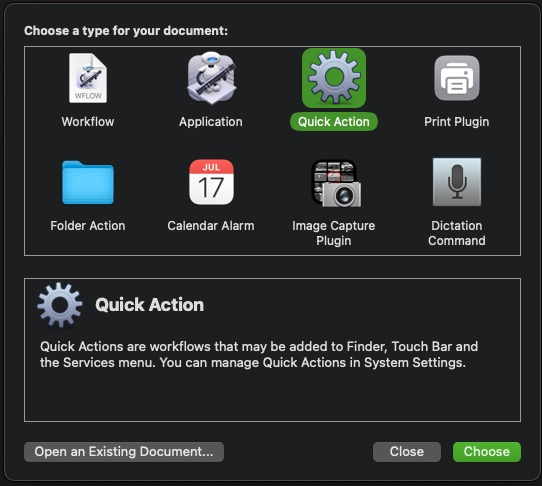
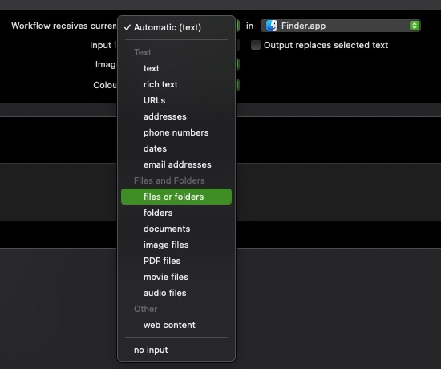
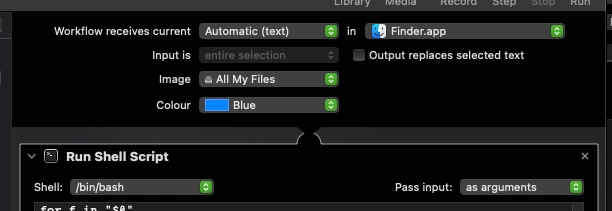
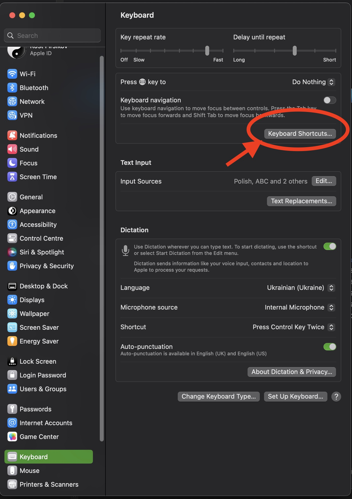
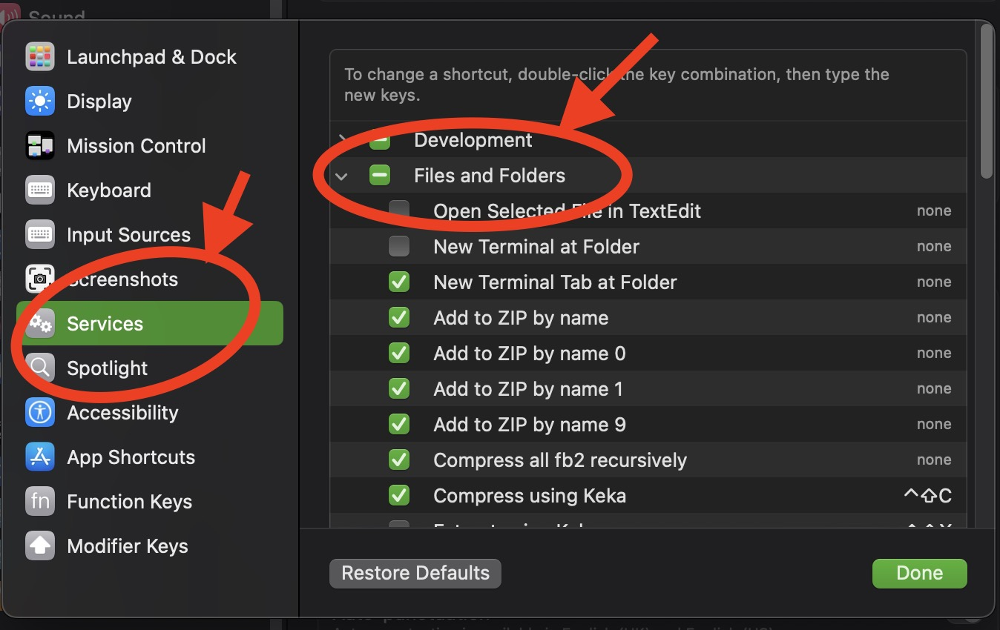
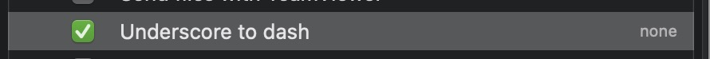

# 🖱 macOS Automator Droplet — Replace `_` with `-` in filenames

This Automator **Application** (Droplet) allows you to drag and drop one or more files from Finder, and it will automatically rename them by replacing all underscores `_` with dashes `-`.

---

## ⚙ How it works

- Built in **Automator** as an **Application** (Droplet).
- Uses a **Shell Script** inside Automator to process dropped files.
- Creates a log file at `~/droplet-debug.log` for each run (overwrites each time).
- Works with multiple files at once.
- No pop-up dialogs — runs silently.

---

## 📋 Shell Script inside Automator

In Automator, the **Run Shell Script** action contains:

```bash
#!/bin/bash
LOGFILE="$HOME/droplet-debug.log"

# Create new log (overwrite)
echo "=== Droplet started at $(date) ===" > "$LOGFILE"

for f in "$@"; do
  echo "Processing: $f" >> "$LOGFILE"
  dir=$(dirname "$f")
  base=$(basename "$f")
  newbase="${base//_/-}"
  if [[ "$base" != "$newbase" ]]; then
      mv "$f" "$dir/$newbase"
      echo "Renamed to: $newbase" >> "$LOGFILE"
  else
      echo "No change needed" >> "$LOGFILE"
  fi
done

echo "=== Droplet finished ===" >> "$LOGFILE"
```

---

## 🛠 How to create the Droplet

1. Open **Automator**.  

2. Select **New Document** → **Application**.  

3. Add the action **Run Shell Script**. (Find *shell* and double-click on result)

4. Change default shell in top left corner. In the top right of the action, set **Pass input:** to **as arguments**.  

5. Paste the script above into the action.  
6. Save the application (e.g., `Underscore to dash.app`) in a convenient location (e.g., `~/Applications` or Desktop).  

---

## 🚀 Usage

- Drag and drop one or more files onto the Droplet icon.  
- The script will rename them by replacing `_` with `-`.  
- Check the log at:  

```bash
cat ~/droplet-debug.log
```

Example log:  

```
=== Droplet started at Wed Sep 10 18:44:05 EEST 2025 ===
Processing: /path/to/file_name_with_underscores.jpg
Renamed to: file-name-with-underscores.jpg
=== Droplet finished ===
```

---

## 📌 Notes

- The script replaces **all** underscores in the filename, not just the first one.  
- The log file is overwritten on each run.  
- Works only with files, not folders (can be extended to handle folders recursively if needed).  
- If files are in protected locations, you may need to grant the Droplet **Full Disk Access** in  
`System Settings → Privacy & Security → Full Disk Access`.

## ⚡ Optional: Create as a Quick Action (Service)

You can also use the same script as a **Quick Action** in Finder, so you can run it from the right‑click menu without dragging files to the Droplet.

---

### 🛠 How to create the Quick Action

1. Open **Automator**.  
2. Select **New Document** → **Quick Action** (in older macOS versions this is called **Service**).  

3. At the top of the workflow window, set:
 - **Workflow receives current:** `files or folders`
 - **in:** `Finder`

4. Add the action **Run Shell Script**.  
5. Don't forget to in the top right of the action, set **Pass input:** to **as arguments**.  

6. Paste the same shell script from above into the action.  
7. Save the Quick Action (e.g., `Underscore to dash`) — it will now appear in Finder's **Quick Actions** menu.

---

### 🚀 Usage in Finder

- Right‑click one or more files in Finder.  
- Choose **Quick Actions** → `Underscore to dash`.  
- The script will rename them by replacing `_` with `-`.  
- Check the log at:

```bash
cat ~/droplet-debug.log
```

---

### ⌨️ Tip: Assign a Keyboard Shortcut

For even faster use of the Quick Action, you can assign a custom keyboard shortcut.  
For example, `⌘ ⇧ -` works well for replacing underscores with dashes.

**How to set it up:**

1. Open **System Settings** (or **System Preferences** on older macOS).
2. Go to **Keyboard** → **Keyboard Shortcuts…**.

3. In the left panel, select **Services** (or **Quick Actions** in newer macOS).

4. Find your Quick Action (e.g., `Underscore to dash`) in the list.

5. Click **Add Shortcut** or double click to `none` and press your desired key combination — for example:  
**`⌘ ⇧ -`**.
6. Press `Done` — the shortcut is now active.

Now you can simply select files in Finder and press your shortcut to rename them instantly, without opening menus.
---

### 📌 Notes for Quick Action

- Works the same way as the Droplet, but is available directly in Finder's context menu.  
- You can assign a keyboard shortcut in  
`System Settings → Keyboard → Keyboard Shortcuts → Services`.  
- File for `Quick Action` located at `~/Library/Services`
- Requires the same permissions as the Droplet for protected locations (Full Disk Access).